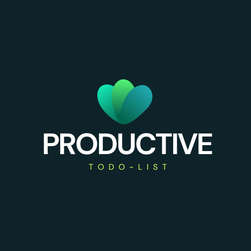
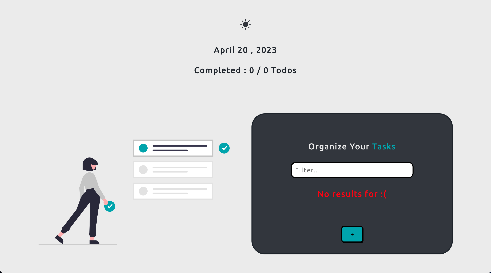
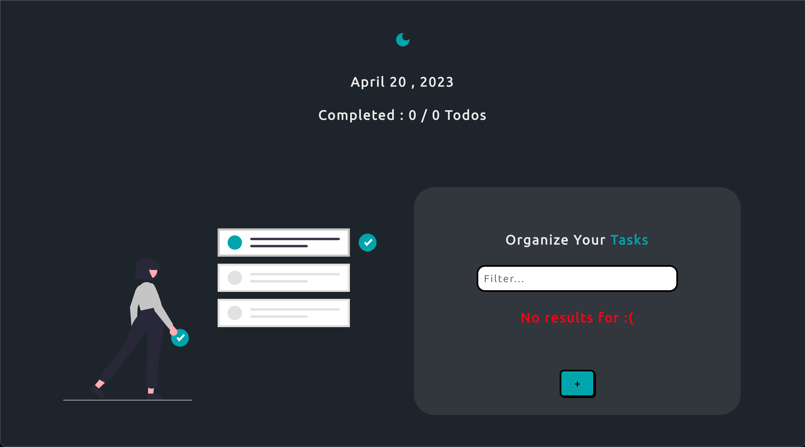
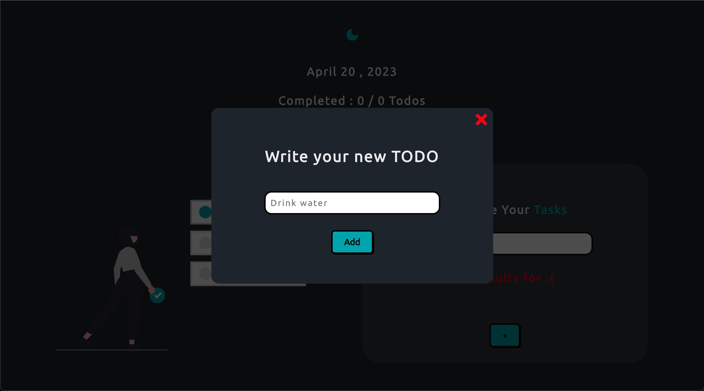

<br/>
<p align="center">
  <a href="https://github.com/davidperjac/productive-list">
    
  </a>

  <h3 align="center">Productive Todo List</h3>

  <p align="center">
    A simple yet awesome Todo List!
    <br/>
    <br/>
  </p>
</p>

   

## Table Of Contents

* [About the Project](#about-the-project)
* [Technologies Used](#technologies-used)
* [Getting Started](#getting-started)
  * [Installation](#installation)
* [License](#license)
* [Authors](#authors)

## About The Project



This is a simple Todo List web application built using React. The application allows users to add and remove tasks, mark tasks as complete, and filter tasks by name. The application has been designed with a clean and intuitive user interface with dark mode included, making it easy for users to manage their tasks.



The main goal of this project is to demonstrate the use of React in building a modern web application. It also serves as a good starting point for developers who are new to React and want to learn how to build real-world applications using the library.



It was built to practice the use of Custom Hooks, the usage of Context API and the implementation of a Dark Mode. 

## Technologies Used

This application was built with: 
-  React 
-  Framer Motion
-  Context API
-  SCSS

## Getting Started

To use this application, simply clone the repository, install the dependencies, and start the development server. Here are the steps:

### Installation

1. Clone the repo

```
git clone https://github.com/davidperjac/productive-list.git
```

2. Install NPM packages

```
npm install
```

3. Start the development server

```
npm start
```

4. Open your web browser on `http://localhost:3000`

## License

Distributed under the MIT License. See [LICENSE](https://github.com/davidperjac/productive-list/blob/main/LICENSE.md) for more information.

## Authors

* **David Perez** - *FullStack Developer* - [David Perez](https://github.com/davidperjac) - *App*

